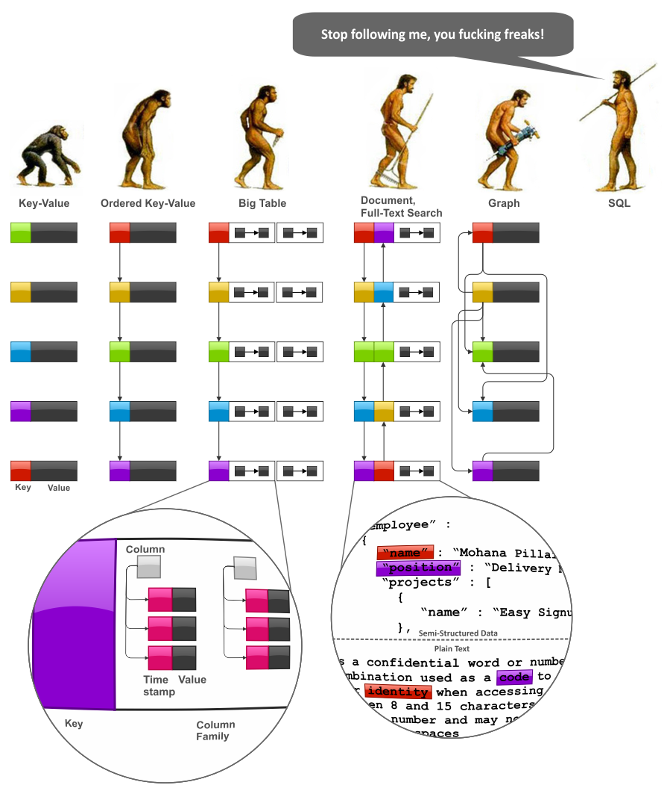

# Name 3 advantages to Test Driven Development
1- Make programming process easier.
2- Discover errors without human testing.
3- Decrease time and money costs by decreasing the numbers of reviewing times.

# What is one downside of Test Driven Development?
Big time investment.
Additional Complexity.
Design Impacts. 
Continuous Tweaking.

# What’s the primary difference between ES6 Classes and Constructor/Prototype Classes?
In classes we do not use prototypes.

# SQL vs NoSQL DB
The most important different between sql and NoSQL is that sql supports the relational database while there is no relational database in NoSQL. Besides that there is another important different that sql DB folows a strict schema while NoSQL DB do not folow any schemas. These are the main differences.
## NoSQL
In NoSQL DB there is no tables, instead we have collections and there is no record, instead we have document. Document comes in the structure of json and each document in the same collection can have a different schema.

## Schema
As we said before SQL uses strict schema for adding data recodrs to tables while in NoSQL the must not follow a specific schema.

## Scalling
SQL suppors horizintal scalling but it has some limitaions while it do not support vertical scalling. NoSQL support both of horizantal and vertical scalling.

## SQL or NoSQL
We decide to use SQL or NoSQL according to app itself. If we have an application that have tens of thousands of queries then it is better to use NoSQL since it is faster in this case because SQL takes much time while fetching data from each table. But if we are working on a project whose main task is to enter tens of thousands of data fields, then using SQL is better because NoSQL takes much time updating the data in the collection.

## NoSQL Data Modeling
To  explore data modeling techniques, we have to start with a more or less systematic view of NoSQL data models that preferably reveals trends and interconnections. The following figure depicts imaginary “evolution” of the major NoSQL system families, namely, Key-Value stores, BigTable-style databases, Document databases, Full Text Search Engines, and Graph databases:
