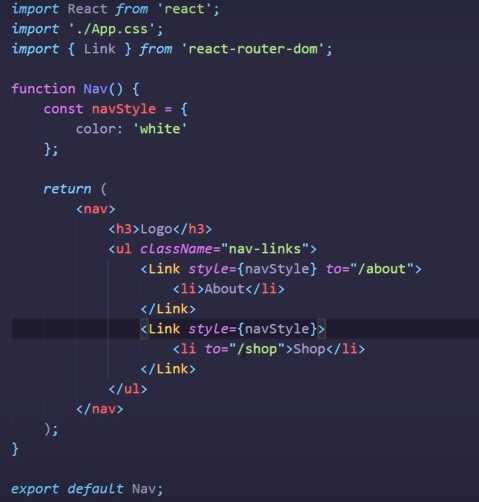
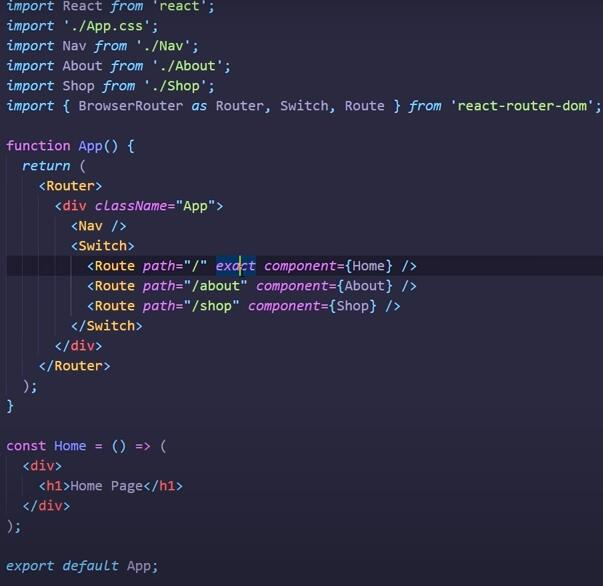

# React Router
React routing went through several stages. In the start, it was hard to understand it's configuration siance it was passed disguised as pseudo-components. In React Router v4, it becomes easier since everything is “just components”.

## Using Router
When starting a new project, you need to determine which type of router to use. For **browser based projects**, there are <BrowserRouter> and <HashRouter> components. Both BrowserRouter and HashRouter components were introduced in React Router ver.4 as subclasses of Router class. 
 The <BrowserRouter> should be used when you have a server that will handle dynamic requests (knows how to respond to any possible URI), while the <HashRouter> should be used for static websites (where the server can only respond to requests for files that it knows about). Simply, BrowserRouter syncs the UI with the current URL in your browser, This is done by the means of HTML-5 History API. On the other hand, HashRouter uses the Hash part of your URL to sync.

## History
Each router creates a history object, which it uses to keep track of the current location 1 and re-render the website whenever that changes. The other components provided by React Router rely on having that history object available through React’s context, so they must be rendered as descendants of a router component. A React Router component that does not have a router as one of its ancestors will fail to work.

## Example:
  
In this example we declared a react component called Nav which returns the Link components. Link component is a ready component from react. Inside the Link component we have to provide the to attribute filling it with route for this item.

### In the App.js file we will do:
Import routerBrowser and name it as Router from react-router-dom.
Import Switch from react-router-dom.
Import Route from react-router-dom.
Import the page's componet we want to navigate to.
Import the nav's componet.
App will return Router component containg Switch component.
Switch component contains Route components.
Route component takes two attributes: path which refers to the route url and component which refers to the component to be displayed when hitting this route.

