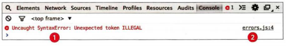

# Error handling and debugging
In JavaScript and in most of programming languages, errors are the main challenge especially when working with big projects since when working with big projects it is hard to review project’s code. So we need a comfort mechanism to handle errors. The best practice to illuminate most of errors is by writing clean code which means you can easily review it.

## The stack
JavaScript execute one line of code per time. When line of code need any values from another places it push to the stack the needed function or variable and when finish it will pull it from stack. While the new function are in the top of stack the line of code which invoked the new function will stay waiting.

## ERROR OBJECTS
When you get error message, it should contain one of seven types of errors. It’s called error objects and each object refers to one type of errors. Syntax Error refers to an error in the syntax such as parenthesis and quotations Referenced errors refers to variable errors such as variable not found. We talked about two error objects and Ev alError, UR I Error, Type Error, RangeError, NaN will be covered in the coming notes.

## HOW TO DEAL WITH ERRORS
To deal with an error, you have two ways: one you do after the error occurs and the other you do before the error occurs.

1: DEBUG THE SCRIPT TO FIX ERRORS
This way of handling errors works after the error appears. In this way, according to error message you should go to the line that the message refers to, review it and try to find the error.

2: HANDLE ERRORS GRACEFULLY
This is the best practice for handling errors. If you expect an error you can write code to run when that error occurs. For example you may face an error regarding the network connection, in this case you can write code to alert or print in the console that there is an error in the connection. The syntax of writing error’s handling code is using try, catch, throw and finally statements. The body’s code will run if no errors, catch’s code will run  if there is an errors and finally’s code  will be implemented if there is an error or not.
      
