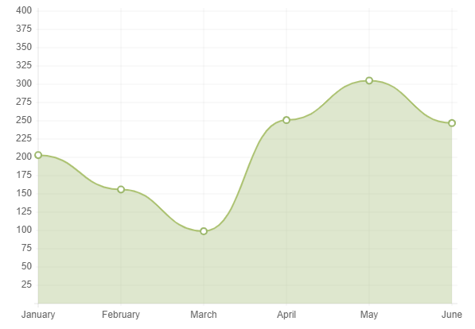
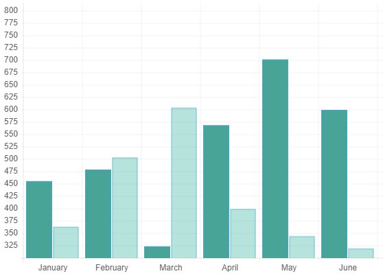
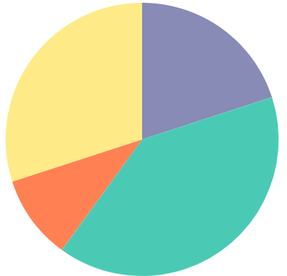

# Charts js
No one can disagree with that charts are easier and morle clear than tables. Charts are very important and we need it continually. JavaScript provided us with a plugin called Chart.js that uses HTML5’s canvas element to draw the graph onto the page. Chart.js is an external plugin which means it is not available internal JavaScript and you need to dwonload it before start using it. We can declare chart using the element \<canvas>

## Example:
In this example we have declared a canvas tag in the html file with the id buyers, then we use the id to access the canvan tag from javaScript file, then we add the content of buyerData array to the canvas element.

### HTML file:
\<canvas id="buyers" width="600" height="400"></canvas>

### JavaScript file:
var buyerData = {  
	labels : ["January","February","March","April","May","June"],  
	datasets : [  
		{  
			fillColor : "rgba(172,194,132,0.4)",  
			strokeColor : "#ACC26D",  
			pointColor : "#fff",  
			pointStrokeColor : "#9DB86D",  
			data : [203,156,99,251,305,247]  
		}  
	]  
}  
var buyers = document.getElementById('buyers').getContext('2d');  
new Chart(buyers).Line(buyerData);  
## chart types
In JavaScript we can draw many types of charts. Bar, Pie and Area are the main charts and commonly used.

## Area chart

  

## Pie chart

  

## Bar chart

  

## Applying styles and colors to cavas element
If we want to apply colors to a shape, there are two important properties we can use: fillStyle which is used to sets the style used when filling shapes and strokeStyle which is used to sets the style for shape's outlines.

### fillStyle Syntax
ctx.fillStyle = color;

### strokeStyle Syntax
ctx.strokeStyle = color;

